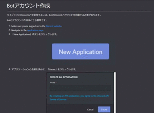

<!---->
# **Discord ヘビーユーザによる**
## **discord.py 解説**

---

## おまえ誰よ

- 塚田 貴史
- Discord 歴 4 年(2016 年から)
  - (歴が長いだけ....とはいわせない!!)
- お仕事・趣味で Python に触れている
- **重度**(**重度**)のゲーマー
- github/takapdayon

---

## LT で持って帰ってもらいたいもの

- bot の開発は簡単だよ!
  - 余計な申請とかいらないよ!
- bot を導入したサーバが豪華になるよ
- 世の bot(slack とか)と同じように開発できるよ

---

## アジェンダ

<!--TODO きれいにする-->

- Discord について
- discord.py
  - 何ができる!?
    - 最小限のコード紹介
    - トリガー紹介
  - discord.py の中身をちらっと覗き見
- まとめ

---

<!-- _class: title -->
<br>
<br>
<br>
<br>
<br>

## Discord 使ってますか?

---


---

## Discord

元々はゲーマー向けコミュニケーションツールとしてデビュー
今では、大学・企業・ゲーム以外のコミュニティでも幅広く活躍!!!

- Python.jp
- etc...

そして、なんとサーバ費は驚きの ZERO!(ブーストはあります)
そんな Discord サーバ...

---

<!-- _class: title -->
<br>
<br>
<br>
<br>
<br>

## 豪華にしたくないですか?

---

<!-- _class: title -->
<br>
<br>
<br>
<br>
<br>

## 便利にしたく...ないですか?

---

<!-- _class: title -->
<br>
<br>
<br>
<br>
<br>

## その願い、**discord.py**で叶うかもしれません!

---

## discord.py

Discord API をラップして Python から使えるようにしたライブラリ
中で Discord との認証等ごにょってくれているためとてもありがたい

---

## 始め方

- discord bot を作成する
- pip で discord.py を入れる

これだけです!

---

## 1: discord bot を作成する

discord.py で紹介されています
https://discordpy.readthedocs.io/en/latest/discord.html

見てわかる通り、やることは凄く少ないです



---

## 2: pip で discord.py を入れる

おなじみパッケージ管理ツール pip を使います

```sh
$ pip install discord.py

# 音声系を使う場合
$ pip install discord.py[voice]
```

---

<!-- Scoped style -->
<style scoped>
section {
  font-size:25px;
}
</style>

# 最小限のコード

<!-- TODO ハイライトを見やすくする -->

公式からサンプルで出されている最小限コードです
https://discordpy.readthedocs.io/en/latest/quickstart.html

```python
import discord

client = discord.Client()

@client.event
async def on_ready():
    print('We have logged in as {0.user}'.format(client))

@client.event
async def on_message(message):
    if message.author == client.user:
        return

    if message.content.startswith('$hello'):
        await message.channel.send('Hello!')

client.run('Botトークン')
```

---
<!-- Scoped style -->
<style scoped>
section {
  font-size:25px;
}
.highlighted-line {
  background-color: #ff0;
  display: block;
  margin: 0 -16px;
  padding: 0 16px;
}
</style>
# 最小限のコード

<!-- TODO ハイライトを見やすくする -->

公式からサンプルで出されている最小限コードです
https://discordpy.readthedocs.io/en/latest/quickstart.html

```python {15-16,18}
import discord

client = discord.Client()

@client.event
async def on_ready():
    print('We have logged in as {0.user}'.format(client))

@client.event
async def on_message(message):
    if message.author == client.user:
        return

    if message.content.startswith('$hello'):
        await message.channel.send('Hello!')

client.run('Botトークン')
```

---

## 動かしてみよう

先ほどのコードを実行してみたいと思います

```sh
$ python Main.py
We have logged in as test-slack
```

これだけで、discord.py 側で、よしなにしてくれます

---

## 試す

bot を導入した Discord サーバで$hello と投稿してみましょう
Bot が Hello!と返してくれれば成功です


---

## 何をトリガーにできるのか

一覧は discord.py の API で紹介されています
https://discordpy.readthedocs.io/ja/latest/api.html


---

## ちらっと中身解説

```python
client = discord.Client()

@client.event
async def on_message(message):
    if message.author == client.user:
        return
```

- @client.event
  - 対象の関数が**コルーチン関数**か判定し、コルーチンの場合は client にインスタンス変数として保持させます

---

## ちらっと中身解説

```python
client = discord.Client()

@client.event
async def on_message(message):
    if message.author == client.user:
        return
```

- async def on_message(message):
  - discord.py側で実行する関数です。messageの中にチャットしたサーバ等の情報が入ってます

- if message.author == client.user:
  - メッセージを発信した対象が bot 自身か判定(無限ループ防止)

---

## ちらっと中身解説

```python
client.run('Botトークン')
```

- client.run()
  - 中でstart関数(login関数とconnect関数)がTaskとして登録され、run_forever()で永続化されて動いています。
  asyncio の低レベルAPI()がゴリゴリ動いているので、興味ある方は見てみると面白いかもしれません!

---

## まとめ

- bot 開発は簡単に行える(ホントに敷居が低いです!)
- 世に出回っている BOT は安全ではない場合もあります
  - slackbot とか google エクステンションと同じですが...

---

<!-- _class: title -->
<br>
<br>
<br>
<br>

## You are the server customizer Champion!
## (ご清聴ありがとうございました!)